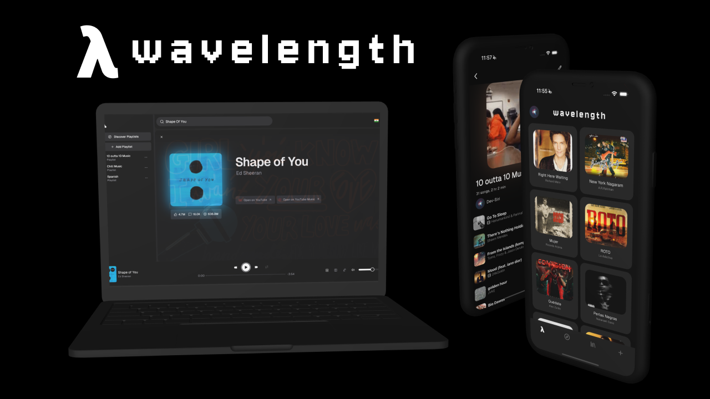

# WaveLength



Wavelength is a cross-platform music app. It wraps Rapid API's YT Music API and YouTube's official v3 API. Available for both the web, written in TypeScript (SvelteKit) and mobile, written in Dart (Flutter), with the backend code written in Go, deployed to [render.com](https://render.com) using a standardized Docker environment. Uses a PostgreSQL Database, hosted on Neon.

I made the same mistake like before and overcomplicated the tech stack.

## Getting Started

Clone the project.

```sh
$ git clone https://github.com/Dev-Siri/wavelength
```

Go to the web application and run it with dev mode. Make sure you create a `.env.local` file and enter your own credentials as shown in `.env.example`

```sh
$ cd web
$ bun dev
# or
$ pnpm dev
```

For the Flutter app, navigate to `/mobile`. Make sure you have Flutter and the native tools like Android Studio/XCode installed on your system beforehand.
Make sure to create a `.env` file (NOT `.env.local`) for mobile as well and enter your own credentials as shown in `.env.example` for mobile.

Then you can run the dev command.

```sh
$ flutter run
```

Finally to get the application running for real, navigate to `/server` and start the Go server. Again, also make sure to fill the environment variables for the server as well, making sure that they are correct for both the docker and regular environments.

Please note however that if you're compiling the binary yourself, (As shown in `1.`) you need to download additional binaries for the application to work. Namely, you'll need the `yt-dlp` binary and the `GeoLite2-Country.mmdb` database.

You can download `yt-dlp` from their releases [here](https://github.com/yt-dlp/yt-dlp/releases/latest/download/yt-dlp).

To download the GeoLite2-Country database, you'll need to register for a free MaxMind account [here](https://maxmind.com/en/geolite2/signup), after which you can download specifically the "GeoLite2-Country" database.

Once you've got the binaries, create a directory `lib` and place both the GeoLite2 Database and the yt-dlp binary. Finally you can run the second command.

```sh
# 1. Run it directly.
$ go run main.go
# OR: Compile to a binary, then run it.
$ go build -v -trimpath -ldflags=-s -ldflags=-w -buildvcs=false -o ./bin/wavelength .
$ ./bin/wavelength

# 3. Better yet, build the docker image, then run it.
# The builder will automatically fetch the required dependent binaries
# So you don't need to download them on your own.
$ docker build . -t wavelength/server
$ docker run -p 8080:8080 -e PORT=8080 --env-file=.env.docker wavelength/server
```

## License

This project is MIT licensed. See [LICENSE](LICENSE).
