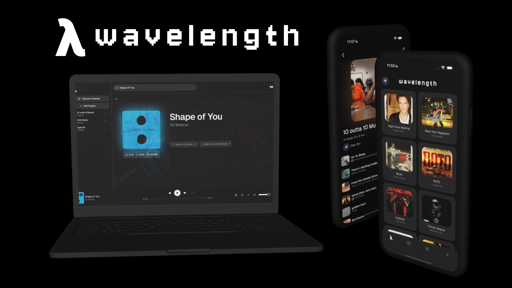

# Wavelength



Wavelength is a cross-platform music app that picks up from YouTube Music to serve an ad-free music-streaming experience while allowing you to download songs offline, while also allowing you to listen to certain songs in higher qualities, ranging from `128kbps Opus/AAC` all the way up to `Lossless FLAC (24-bit/44.1kHz)`.

## Feature Highlights

- Entirety of YouTube Music's catalog, completely ad-free.
- Include normal YouTube Videos in your playlists in-case a certain track/remix is unavailable on normal streaming services.
- High Quality Audio: up-to `320kbps AAC`
- Hi-Res Lossless Audio: Available up-to `24-bit/192kHz FLAC`
- Downloads & offline playback.
- Download supported songs in up to Hi-Res Lossless.
- Discord Mode (Rich Presence, Desktop-only)
- Apple Music-like live album covers.
- UI polish alike Apple Music in many ways.
- Word-synced/Line-synced lyrics with Apple Music-like animations.

## Source

Wavelength gets songs from YouTube and Tidal. However, the primary source is Wavelength's own store. In-case a song is not available on Wavelength's catalog, your phone or desktop runs an extractor on your side called [tydle](https://github.com/Dev-Siri/tydle) that extracts the song from YouTube on your device, and starts playback immediately. In the background, Wavelength sends a request to a server that collects the Song's stream from YouTube and stores it in Wavelength's own Google Cloud Storage bucket as HLS. The collector also collects the Lossless version of the stream, which itself is stored in Wavelength's store, and is also reencoded to `256kbps AAC` and `320kbps AAC` for adaptive streaming on Mobile.

Wavelength always prioritizes streaming natively (from Wavelength's servers) rather than redirecting to a Tidal URL or proxying `yt-dlp`. For this reason, the web version might just be kind of, because if a song is unavailable on Wavelength's catalog, playback on web will wait until it gets collected. However, the problem doesn't exist for Desktop/Mobile because tydle is available.

## Getting Started

Clone the project.

```sh
$ git clone https://github.com/Dev-Siri/wavelength
```

> NOTE: Each of these applications have their .env.example, make sure you fill these variables before running them.

## Desktop

Run the SvelteKit app with dev mode.

```sh
$ bun dev
# or
$ pnpm dev
```

To run the desktop app in dev mode, you will need to have Rust installed on your system. Then run the `tauri` command.

```sh
$ bun tauri dev
```

## Mobile

Make sure you have [Flutter](https://flutter.dev). You'll also need the native tooling for the platform you're running on: Android requires [Android-Studio](https://developer.android.com/studio) and additional command-line tools and packages installed. iOS requires XCode to be installed on your Mac.
Then you can start the application in dev mode:

```sh
$ flutter run
```

## Backend

Almost all microservices are entirely written in Go, with one crucial service, the YouTube Scraper, written in TypeScript (Node) for use of the [`YouTube.js`](https://github.com/LuanRT/YouTube.js) library to retrieve data from the platform.

To run the entirety of the project, you need to have [Docker](https://docker.com) installed on your system. The project includes a `docker-compose.yml` in the `/server` directory. Use the compose commands to start all the microservices up:

```sh
$ cd server
$ docker compose up
# shut all services down
$ docker compose down
```

The microservices use gRPC for communication. If you are looking to make any changes to the protobuf definitions, you need to run `make` to regenerate the gRPC client/server code.

```sh
# generate gRPC definitions
$ make generate
```

Note that the command also runs a `package.json` script with Bun to generate TypeScript definitions. If you do not have Bun installed, then change the `Makefile` to a different JavaScript package manager command. The `yt-scraper` service uses Bun during development (`bun run dev`) but the Dockerfile builds for Node in production. (There is a bug with Bun on GCP for gRPC connections)

## License

This project is MIT licensed. See [LICENSE](LICENSE).
